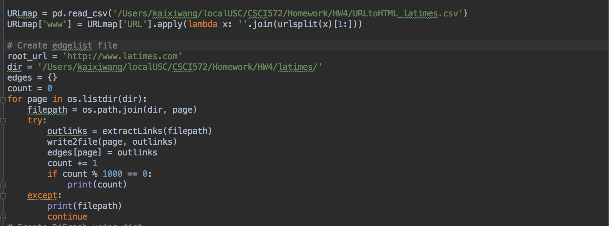
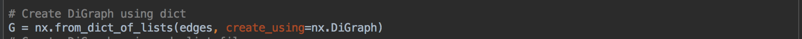

Tutorial: Creating a Search Engine using Solr that implements the Page
Rank Algorithm

INTRODUCTION:

{width="5.254861111111111in"
height="1.3916666666666666in"}The objective of this project was to
familiarize ourselves with using the Apache Solr search platform and
implementing a Page Rank algorithm. To achieve this goal, we were to
create a functioning, web-based search engine for a news outlet. The
search engine UI would allow users to enter queries into a text box on a
webpage displayed in their browser, specify a search and sorting method,
and be returned a new page containing the top ten results, with
clickable links that would bring users to the original page hosted on
the news domain. In order to perform these tasks, a search engine
requires three main elements:

1.  a web page/browser-based UI that accepts user text input

2.  a web server that can deliver web pages and run scripts

3.  a page indexer and query processor

The workflow for creating such a search engine is outlined below:

1.  Index webpages crawled from the news site (LAtimes.com) using Solr

2.  Calculate the page rank score for every webpage indexed

3.  Configure Solr to process requests appropriately

4.  Write scripts to send requests to and process responses from Solr

5.  Design and create a UI to allow the search engine to run in a web
    browser

CONFIGURATION

For this specific implementation, the following configuration is used:

-   OS: Mac OXS High Sierra

-   IDE: PyCharm

-   Language:

    -   Back-end: Python 3.6 + Flask 1.0.2 \*\*

    -   Front-end: CSS/HTML5

-   Search Platform: Solr 7.5.0 \*

-   APIs/Packages/Modules/Libraries:

    -   NetworkX (Page Rank)

    -   urllib.parse

    -   pandas, matplotlib, numpy

\* Solr provides a powerful ready-to-use search platform as a web app.
It is built around the Apache Lucene

framework, which provides full-text search capabilities through inverted
indexing. Additionally, it uses the Apache

Tika toolkit to automatically detect filetypes and extract and map
metadata to content fields

See: <http://lucene.apache.org/solr/>

\*\*  Flask is a microframework based on Werkzeug and Jinja 2 for
Python. It is a microframework because it does not

require particular tools or libraries. it has no database abstraction
layer, form validation, or any other

components. However, it does include a built-in development server and
methods for RESTful request

dispatching.

See: <http://flask.pocoo.org>

STEPS

**Part I: CONFIGURE SOLR**

1.  Install latest version of Solr following the Quickstart instructions
    found here: <http://lucene.apache.org/solr/quickstart.html>

2.  Launch Solr in the terminal: \$ bin/solr start

3.  Create a new core named \'hw4\' : \$ bin/solr create -c hw4

4.  Modify the managed-schema.xml in the conf folder so that all query
    fields are combined into a single, catch-all field called
    \"\_text\_\"

{width="6.5in"
height="1.3909722222222223in"}{width="3.6419761592300963in"
height="0.21750656167979002in"}

{width="6.5in"
height="0.7138888888888889in"}{width="3.417583114610674in"
height="0.19205161854768155in"}

5.  Download crawled pages from the LA times and index the .html files
    (provided) by posting them to the Solr core using the command:

\$ bin/post -c hw4 -filetypes html \<path/to/downloaded/pages/latimes\>

{width="5.6909087926509185in"
height="1.1400054680664917in"}

Note: to index all filetypes, remove \"-filetypes html\"

To confirm that the files were indexed, navigate to the core \'hw4\'
using the Solr UI console in a browser:

<http://localhost:8983/solr/>

{width="5.490908792650918in"
height="2.30665135608049in"}

6.  We want to set the default querying behavior to search the
    \"\_text\_\" catch-all field, so modify the requestHandler of the
    Solr SearchHandler in the solrconfig.xml file to look like:

{width="5.127272528433946in"
height="1.602820428696413in"}

7.  Reload the core with the modified configurations through the Solr UI
    by navigating to the Core Admin page and clicking reload

**Part II: PAGE RANK**

The default ranking algorithm used by Solr/Lucene to determine the
relevance of a document is a combination Vector Space and Boolean model
in which the Boolean model is first used to narrow down the documents
matching the query and then the Vector Space model uses term frequency
to rank the filtered documents. However, Solr can also be configured to
use other algorithms. In the second part of this assignment, we take
advantage of this flexibility by adding the option to sort by Page Rank.

The Page Rank algorithm attempts to rank every web page in order of
importance by taking advantage of the link structure of the Web. In the
simplest implementation of the algorithm, the relative importance score
or \'page rank\' is representative of the number of backlinks to a page
-- a page has a higher page rank if there are more pages pointing to it.
However, because it is realistically impossible to know the number of
backlinks to a particular page at a particular time directly, the
algorithm indirectly calculates the page rank iteratively using the
number of inlinks instead (It is straightforward to find the number of
inlinks from a page by downloading the page and then parsing out the
links.).

From the original Google paper:

\"PageRank or PR(A) can be calculated using a simple iterative
algorithm, and corresponds to the principal eigenvector of the
normalized link matrix of the web.\" The formula used by the algorithm
is:

> *PR(A) = (1-d) + d (PR(T1)/C(T1) + \... + PR(Tn)/C(Tn))\**

Where d is a dampening factor that can be set between 0 and 1, but is
usually set at 0.85

C(A) is the number of outlinks of page A

By iterating over the entire known web until the PR values converge, we
can get the PR score for every page.

\* Some versions of the algorithm include the total number of pages N as
a normalization factor to make PR into a probability distribution that
sums to one. In this case, the formula would be:

*PR(A) = (1-d)/N + d (PR(T1)/C(T1) + \... + PR(Tn)/C(Tn))*

To use the PR algorithm to rank query results, we must provide Solr with
a mapping of filenames to corresponding PR scores for all documents in
our database, and then configure Solr to use this mapping as a search
field. We must do this because, although Solr can use PR scores, it
cannot calculate it behind-the-scenes. Continued below are the steps to
do this. The scripts were written in Python, and the PR algorithm was
implemented using the NetworkX Python library
(<https://pypi.python.org/pypi/networkx/>).

8.  Import the libraries that will be used

{width="3.5175437445319333in"
height="0.8035761154855643in"}

-   BeautifulSoup is a Python package for parsing HTML and XML documents

-   NetworkX is a Python package for creating and manipulating network
    graphs

-   Urllib.parse parses URLs into components

9.  Write a function to return the set of outlinks from a given
    downloaded page:

{width="6.5in" height="1.2166666666666666in"}

10. Create a DiGraph (directed graph) of the linkages between all the
    downloaded html pages in which an edge between page A and page B
    means that A has a link to B. This can be done by storing outlinks
    in a python dictionary (filename: outlinks) or an EdgeList file.

(Note: Both methods were tested and the same results were obtained;
however, only the dictionary method is shown here.)

{width="6.114035433070866in"
height="2.259570209973753in"}

{width="5.962963692038495in"
height="0.32013888888888886in"}

Sample of what the \'edges\' dict looks like:

{width="3.451327646544182in"
height="2.442846675415573in"}

11. Using the DiGraph \'G\', compute the page rank scores using the
    pagerank() function in the NetworkX library

{width="6.897222222222222in"
height="0.36572287839020123in"}

Explanation of Parameters:

-   alpha: 0.85 (standard)

    -   the dampening factor used to prevent pages with no outgoing
        links (dangling pages) from accumulating all the PR of the pages
        that link to them. It weights the relative PR received from
        external pages to the internal link structure. The value of
        alpha affects the rate of convergence. A low damping factor
        equates to higher damping and a faster rate of convergence. A
        high damping factor equates to less damping and cause the total
        PR to grow higher.

-   personalization: None

    -   allows for selectively downplaying or raising the importance for
        certain nodes, which biases scores towards specific sites
        (useful for creating personal recommentations or subject-matter
        specific recommendations)

    -   None because we are not trying to make a personalized search
        engine

-   max\_iter: 30

    -   Maximum number of iterations allowed for the algorithm to find
        convergence

    -   The original Google paper found that it took 52 iterations for a
        322 million link database to converge to a reasonable tolerance
        and 45 iterations for half the database.

-   tol: 1e-06

    -   error tolerance used to check convergence

    -   1e-06 is reasonable for the number of pages being used

-   nstart: None

    -   optional dictionary containing starting value of PageRank
        iteration for each node

    -   Since we aren\'t using/don\'t have previous values for page rank
        for each page, we set it as \'None\'

-   weight: \'weight\'

    -   optional edge data key to use as weight. If None weights are set
        to 1

    -   \'weight\' is an internal representation of the query created by
        Lucene during indexing that allows the query to be reused by the
        searcher

> (See: <https://lucene.apache.org/core/3_5_0/scoring.html>)

-   dangling: None

    -   dict of outlinks assigned to dangling nodes where the key is the
        node pointed to and the value is the weight of the outlink
        (dangling dict is used with personalization and often the same
        as personalization dict)

    -   Here, set to \'None\' because we aren\'t trying to bias the
        scores for a particular page or set of pages

> {width="3.329861111111111in"
> height="1.75in"}{width="3.3291666666666666in"
> height="1.761111111111111in"}Here are some of the scores:

12. Now that the PR scores have been calculated, save them in a file
    named \'external\_pageRankFile\' in which each line has the format
    \'\<doc\_id\>=\<score\>\'

Save it in the \'conf/data\' folder of the core so that Solr will be
able to find it.

{width="6.5in" height="0.9534722222222223in"}

Screenshot of \'external\_pageRankFile\'

{width="6.5in" height="2.49375in"}

13. For Solr to know to use PR scores for ranking, define a new external
    field type \'external\' with name \'pageRankFile\' by modifying the
    managed-schema.xml

{width="6.5in"
height="0.4847222222222222in"}(Note: the field name is the part of the
file name following \'external\_\')

-   The ExternalFIleField retrieves values from the external
    pageRankFile instead of the index. The benefit of this is that the
    PR scores can be updated independently of the documents themselves,
    so no re-indexing is required.

```{=html}
<!-- -->
```
-   Addition of fieldType with name \"external\" tells Solr to get the
    PR scores from the data folder

    -   keyField: id is the unique key for the index

```{=html}
<!-- -->
```
-   defVal: default PR value is 0 if not found in the external file

```{=html}
<!-- -->
```
-   Addition of field with name \"pageRankFile\" tells Solr to use PR
    for sorting when \"pageRankFile asc/desc\" is included in the query

-   The property \'indexed\' is a Boolean that, if true, allows the
    value to be used in queries to retrieve matching documents, and the
    property \'stored\', if true, allows the actual value of the field
    to be retrieved by queries. Since we don\'t actually want to query
    the PR score -- only use it for ranking -- these are set to
    \'false\'

14. To allow Solr to access scores in the file
    \'external\_pageRankFile\', define new eventListeners in the
    solrconfig.xml file between the \<query\>...\</query\> tags. This
    will ensure that the external file will be reloaded when a searcher
    is loaded or started. (The searcher is a Lucene class that enables
    searching across the Lucene index. )

> {width="6.5in" height="0.3548611111111111in"}

15. Since the configurations have been updated, reload the index under
    the Core Admin page in the Solr Dashboard UI

**PART III: In-Browser Search Engine User Interface**

To final task in creating the search engine is to create a UI that can
deploy in the browser. The UI is essentially a webpage that must contain
a text box for users to enter queries as well as some way for the users
to specify which algorithm to use and in what order to display the
results. The design and layout of the page is coded in HTML/CSS using
templates. However, for the website to actually be functional, access to
a webserver is required.

For this implementation, Python coupled with Flask is sufficient to test
the UI in a browser. However, to deploy the search engine on a real web
server (Apache), you must install mod\_wsgi.

16. Install flask for python3.6:

\$ pip3 install flask

17. Create a .py file for scripting the webserver actions.

To use Flask, create an instance of the Flask class \' app\', which will
serve as the WSGI application. Also, create a \'static\' folder in the
same directory as the .py script, which will be where all the templates
will be stored. Assign the path to \'app.\_static\_folder\' so \'app\'
knows where to look for templates.

{width="4.890625546806649in"
height="1.120295275590551in"}

18. Set default values for the search parameters to prevent errors
    arising in cases where users fail to specify them:

{width="5.671641513560805in"
height="0.7041076115485564in"}

19. The webserver is responsible for formatting the query, sending it to
    Solr, and retrieving the results so that they can be parsed and
    displayed in the search results page. On the front-end, users are
    presented a search engine home page and then redirected to a results
    page.

{width="3.9381944444444446in"
height="2.4833333333333334in"}{width="5.357638888888889in"
height="2.8194444444444446in"}{width="5.370833333333334in"
height="2.1951388888888888in"}The following is the code to implement
these actions:

Note: The website URLs are defined using the rout() decorator. Functions
are both triggered by rout() and used to generate URLs. HTML templates
are loaded using the render\_template() method in the return statement
of a function.

{width="3.5368055555555555in"
height="0.4284722222222222in"}To run the script in a browser, conclude
the script with:

> {width="5.506944444444445in"
> height="1.1979166666666667in"} Here is the what happens when you run
> the script in console in debugger mode:

{width="6.71875in"
height="4.098611111111111in"}{width="2.0069444444444446in"
height="0.2923611111111111in"}Opening the server URL in browser:

Example search using the default algorithm:

-   {width="6.625in"
    height="4.690972222222222in"}Enter query, select \'Default\', select
    \'Descending, click the \'Submit\' button

-   Redirected to results page:

{width="4.625in" height="0.320239501312336in"}

{width="6.65625in"
height="2.8472222222222223in"}{width="6.575694444444444in"
height="4.211111111111111in"}

-   Click on the first title:

{width="5.6842104111986in"
height="3.429352580927384in"}

Example \#2: Search using PageRank

{width="6.5in" height="4.294444444444444in"}

{width="6.5in" height="4.3902777777777775in"}

{width="6.5in" height="2.55in"}

{width="2.9115048118985127in"
height="0.2034547244094488in"}{width="5.2300885826771655in"
height="2.922367672790901in"}

Here are the results for the same query \'Lebron James,\' but in
ascending order using each algorithm:

{width="4.309027777777778in"
height="2.0805555555555557in"}{width="3.6125in"
height="3.0083333333333333in"}Default:

Page Rank:

{width="4.2027777777777775in"
height="2.220833333333333in"}{width="4.1008092738407695in"
height="3.247787620297463in"}
